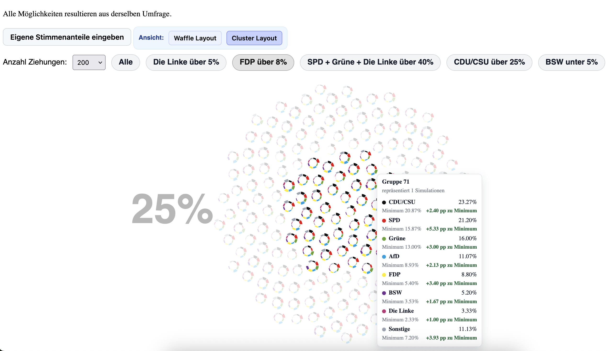
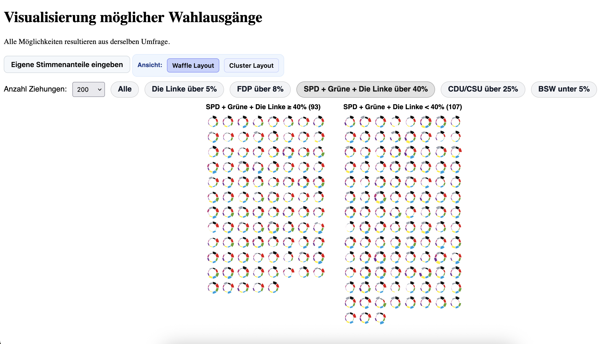

# Wahlausgänge – Bundestagswahl Simulation

An interactive visualization of possible German federal election outcomes using Monte Carlo simulation. The app samples thousands of possible election draws from a given set of vote-share probabilities and displays each draw as a small donut chart. Users can explore scenarios, switch between layout modes, and enter their own vote shares to immediately see how the distribution of outcomes changes.

---

## What the app does

- **Monte Carlo simulation** — Each draw samples 1 500 virtual voters according to the configured party vote shares and records how the votes are distributed. By default 200 draws are shown; you can increase this up to a large number using the controls.
- **Two layout modes**
  - _Cluster_ — donuts sorted and coloured by their dominant party to reveal natural groupings.
  - _Waffle_ — donuts laid out in a phyllotaxis spiral, optionally split into two columns by a scenario filter.

  | Cluster view                                   | Waffle view                                  |
  | ---------------------------------------------- | -------------------------------------------- |
  |  |  |

- **Scenario filters** — Quickly highlight draws that match predefined political scenarios (e.g. FDP above 5 %, SPD + Greens + Linke above 40 %).
- **Hover tooltip** — Hovering or focusing a donut shows the exact vote shares for that draw together with the minimum share seen across all draws. The tooltip stays fully on screen regardless of cursor position.
- **Custom vote shares** — A button opens a popup form where you can enter your own vote percentages for each party. "Others" is calculated automatically so the total always sums to 100 %. If the editable values exceed 100 % a warning appears and the form cannot be submitted. On submit the simulation immediately reruns with the new inputs.

---

## Tech stack

| Layer                | Library / version                                            |
| -------------------- | ------------------------------------------------------------ |
| Framework            | [SvelteKit](https://kit.svelte.dev) `^2.50` / Svelte `^5.51` |
| Build tool           | [Vite](https://vitejs.dev) `^7.3`                            |
| Data visualisation   | [D3](https://d3js.org) `^7.9`                                |
| Linting / formatting | ESLint + Prettier                                            |

---

## Project structure

```
src/
  lib/
    pages/
      SimulationHomePage.svelte   ← main page content
      VoteSharesPage.svelte       ← vote-share input form (popup)
    simulation/
      SimulationLayout.svelte     ← visual rendering stage (donuts + FLIP animations)
      LayoutSwitch.svelte         ← waffle / cluster toggle
      ScenarioControls.svelte     ← count selector + scenario filter buttons
      scenarios.js                ← scenario definitions and filtering helpers
      simulation.js               ← Monte Carlo math
      layout.js                   ← phyllotaxis and waffle position helpers
    Simulation.svelte             ← top-level orchestrator
    SimulationTooltip.svelte      ← responsive hover tooltip
    DrawDonut.svelte              ← single donut renderer
    Donut.svelte                  ← base donut arc component
    data/
      bundestag_prediction_2026_simulation.json
  routes/
    +page.svelte                  ← route wrapper → SimulationHomePage
    vote-shares/
      +page.svelte                ← route wrapper → VoteSharesPage
```

---

## Setup

**Prerequisites:** Node.js 18 or newer, npm.

```sh
# 1. Clone the repository
git clone <repo-url>
cd <repo-folder>

# 2. Install dependencies
npm install

# 3. Start the development server
npm run dev
```

The app will be available at `http://localhost:5173` (Vite may pick a different port if 5173 is in use — check the terminal output).

---

## Available scripts

| Command           | Description                              |
| ----------------- | ---------------------------------------- |
| `npm run dev`     | Start development server with hot-reload |
| `npm run build`   | Production build                         |
| `npm run preview` | Preview the production build locally     |
| `npm run lint`    | Check formatting and linting             |
| `npm run format`  | Auto-fix formatting with Prettier        |

---

## Data

The simulation is driven by `src/lib/data/bundestag_prediction_2026_simulation.json`. This is a **synthetic demo dataset** — it is not based on real polling data. To use different base vote shares, either edit the JSON file directly or use the in-app "Eigene Stimmenanteile eingeben" form.

---

## Developing

Once you've created a project and installed dependencies with `npm install` (or `pnpm install` or `yarn`), start a development server:

```sh
npm run dev

# or start the server and open the app in a new browser tab
npm run dev -- --open
```

Everything inside `src/lib` is part of your library, everything inside `src/routes` can be used as a showcase or preview app.

## Building

To build your library:

```sh
npm pack
```

To create a production version of your showcase app:

```sh
npm run build
```

You can preview the production build with `npm run preview`.

> To deploy your app, you may need to install an [adapter](https://svelte.dev/docs/kit/adapters) for your target environment.

## Publishing

Go into the `package.json` and give your package the desired name through the `"name"` option. Also consider adding a `"license"` field and point it to a `LICENSE` file which you can create from a template (one popular option is the [MIT license](https://opensource.org/license/mit/)).

To publish your library to [npm](https://www.npmjs.com):

```sh
npm publish
```
